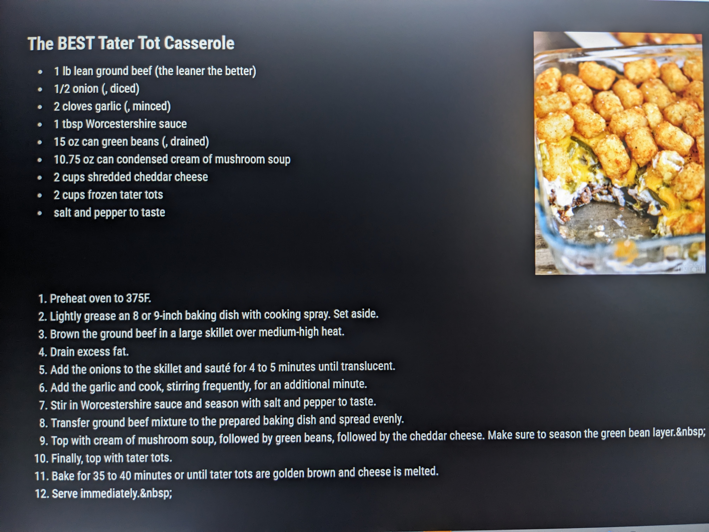

# 🍝 MMM-RecipeReader

A [MagicMirror²](https://magicmirror.builders/) module that displays step-by-step recipes retrieved from the Spoonacular API. You can remotely submit recipe URLs via a web interface or API call.

## ✨ Features

- Parses recipes from publicly available URLs using Spoonacular
- Displays ingredients, instructions, and image
- Remote control via HTML form or HTTP POST
- Supports both interactive and API-based use

## 🖼️ Preview



> _Sample url in example from https://www.momontimeout.com/the-best-tater-tot-casserole/_

---

## 🔧 Installation

1. Navigate to your MagicMirror `modules` directory:

```bash
cd ~/MagicMirror/modules
````

2. Clone this repository:

```bash
git clone https://github.com/zalesol265/MMM-RecipeReader.git
```

3. Navigate into the module folder:

```bash
cd MMM-RecipeReader
```

4. Install dependencies (if any are added in the future):

```bash
npm install
```

5. Add your Spoonacular API key:

   * Create a file at: `MMM-RecipeReader/key/api-key.txt`
   * Paste your Spoonacular API key inside.

---

## 🧪 Configuration

Add the following to your `config.js`:

```js
{
  module: "MMM-RecipeReader",
  position: "top_left", // or wherever you prefer
  config: {}
}
```

---

## 🌐 Remote Control

### 1. HTML Interface

Visit the local server page (from another device on the same network):

```
http://<YOUR_PI_IP>:8080/recipe/remote
```

* Enter a valid recipe URL and submit.
* The MagicMirror will update with the recipe details.

### 2. API Access (e.g. via Postman or curl)

POST to:

```
http://<YOUR_PI_IP>:8080/recipe/control
```

With a JSON body like:

```json
{
  "action": "setUrl",
  "payload": {
    "url": "https://www.example.com/your-recipe"
  }
}
```

---

## 🧠 How It Works

* The front-end (`MMM-RecipeReader.js`) initializes and waits for incoming recipe data.
* The `node_helper.js` handles loading your Spoonacular API key, setting up an Express API, and calling the Spoonacular `extract` endpoint.
* A web form (`remote.html`) lets users submit a recipe URL, which sends a POST request to the node helper.
* Once processed, the recipe is parsed and sent back to the frontend to display.

---

## 📌 Notes

* You must have a valid Spoonacular API key. Free tier available at: [https://spoonacular.com/food-api](https://spoonacular.com/food-api)
* Only public recipe URLs are supported.
* MagicMirror must be running and the module must be loaded in your `config.js`.

---

## 📁 File Structure

```
MMM-RecipeReader/
├── MMM-RecipeReader.js         # Frontend module
├── node_helper.js              # Backend handler and API interface
├── remote.html                 # Web UI to submit recipes
├── key/
│   └── api-key.txt             # Your Spoonacular API key (not tracked in Git)
├── MMM-RecipeReader.css        # Styling
└── README.md
```


## 📃 License

MIT – use, share, and modify freely. Give credit if it helps!

